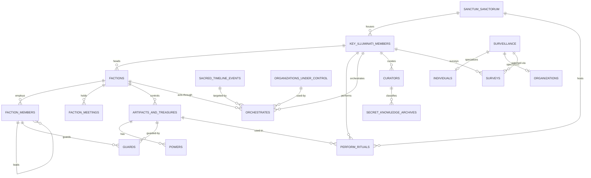

# Illuminati Database Management System (IDMS)

A relational database modelled from scratch — EER diagram, relational mapping, normalization to 3NF — and a terminal client that drives it with hand-written SQL. No ORM: every query in this repository was written directly.

The domain is a fictional secret society: factions, members, artifacts, timeline events, and surveillance operations. 18 tables, 22 foreign keys, MySQL 8.

## Quick start

MySQL runs in a container, so nothing needs installing on the host and no `sudo` is required.

```bash
make db-up      # start MySQL 8.4
make db-load    # create the database, load schema + seed + views
make run        # launch the CLI
```

`make db-reset` returns to a clean fixture at any point — useful after exercising the destructive operations. `make help` lists every target.

Dependencies are declared in `pyproject.toml` and resolved by `uv`; `make run` is just `uv run script.py`.

## Schema



Full DDL: [`sql/schema.sql`](sql/schema.sql). The original hand-drawn EER diagram is at [`docs/er-diagram.png`](docs/er-diagram.png), with the design reports alongside it in [`docs/`](docs/).

Points worth noting in the model:

- **`Faction_Members` references itself** through `Leader_Id`, forming a command hierarchy of arbitrary depth. Roots have `Leader_Id IS NULL`.
- **`Surveillance` is a specialization** into `Individuals` and `Organizations`, both keyed on the parent's id.
- **`Powers` is a separate table** because an artifact has many — the multivalued attribute split out for 1NF.
- **`Curators` exists for 3NF.** Each archive category has one curator, so `Curator` depends on `Category` rather than on `Archive_Id`, and belongs in its own relation.
- **`Orchestrates` is a three-way relationship**: a member acts on an event, for a faction, through a controlled organization.
- Natural keys throughout — members are keyed by `Title`, sanctums by `Mantra` — rather than surrogate integers.

## What the SQL does

### Recursive descent through the hierarchy

`v_member_hierarchy` ([`sql/views.sql`](sql/views.sql)) walks the self-referencing tree to any depth, tracking each member's level:

```sql
WITH RECURSIVE MemberHierarchy AS (
    SELECT Member_Id, Fname, Lname, Faction_Id, Leader_Id, 0 AS Level
    FROM Faction_Members
    WHERE Leader_Id IS NULL
    UNION ALL
    SELECT fm.Member_Id, fm.Fname, fm.Lname, fm.Faction_Id, fm.Leader_Id, mh.Level + 1
    FROM Faction_Members fm
    JOIN MemberHierarchy mh
      ON fm.Leader_Id  = mh.Member_Id
     AND fm.Faction_Id = mh.Faction_Id
)
```

The second join condition matters: the schema does not require a leader to be in the same faction, so without it a cross-faction leader would splice one faction's members into another's tree.

### Window functions

[`sql/analytics.sql`](sql/analytics.sql) holds seven reporting queries covering `RANK`/`DENSE_RANK`, running totals, `LAG`/`LEAD` gap analysis, `NTILE`, `PARTITION BY`, and the top-N-per-group pattern. The leaderboard shows why the two ranking functions are not interchangeable:

```sql
SELECT
    f.Aim,
    COUNT(fm.Member_Id)                                    AS Member_Count,
    RANK()       OVER (ORDER BY COUNT(fm.Member_Id) DESC)  AS Rank_With_Gaps,
    DENSE_RANK() OVER (ORDER BY COUNT(fm.Member_Id) DESC)  AS Rank_No_Gaps,
    ROUND(100.0 * COUNT(fm.Member_Id)
          / NULLIF(SUM(COUNT(fm.Member_Id)) OVER (), 0), 1) AS Pct_Of_All_Members
FROM Factions f
LEFT JOIN Faction_Members fm ON f.Faction_Id = fm.Faction_Id
GROUP BY f.Faction_Id, f.Aim
```

Tied factions share a rank; afterwards `RANK` skips and `DENSE_RANK` does not. `SUM(COUNT(*)) OVER ()` is the interesting part — the window is evaluated *after* `GROUP BY`, so each faction's share of total membership falls out without a second query.

### Query performance

Measured against a 200,000-row generated dataset, selecting one month:

| Predicate | Rows read | Time |
|---|---|---|
| `YEAR(Date) = ? AND MONTH(Date) = ?` | 200,000 | 48.2 ms |
| `Date >= ? AND Date < ?` | 3,000 | 1.32 ms |

The index was present in both cases. Wrapping the column in a function makes the predicate non-sargable, so the index can only be scanned end to end, never seeked — adding it changed nothing until the predicate was rewritten.

[`docs/performance.md`](docs/performance.md) records all three experiments, including two optimizations that were measured and then deliberately *not* applied. [`sql/benchmark/generate.sql`](sql/benchmark/generate.sql) builds the dataset.

## Available Operations

### Retrieval
1. **View Sacred Timeline Events by Illuminati Member** — events orchestrated by a given member, with date, time, status and description.
2. **View Factions by Member Count** — factions above a member threshold, counted from `Faction_Members`.
3. **View Member Statistics** — totals and average membership across all factions.
4. **Search Artifacts by Power** — artifacts matching a power, with origin, procurement date and guard count.
5. **Generate Monthly Faction Report** — meetings in a month, plus the command hierarchy of the factions that met.
6. **Analyze Surveillance Targets** — operations broken down by target type, with nationality and location spread.

### Modification
7. **Add New Faction Member** — with leader assignment, validated against the same faction.
8. **Update Sanctum Sanctorum Location** — street, city and country.
9. **Delete Artifact Record** — child rows in `Powers`, `Guards` and `Perform_Rituals` are removed by `ON DELETE CASCADE`.
10. **Update Key Illuminati Member Name**
11. **Change Faction Head Title**

### Analytics
12. **Faction Leaderboard** — ranked by membership, contrasting `RANK` with `DENSE_RANK`.
13. **Sacred Timeline Event Cadence** — intervals between consecutive events via `LAG`/`LEAD`.

Writes validate their references first, then commit, rolling back and reporting the reason on failure. Every query uses parameter binding.

## Configuration

Connection settings come from the environment, defaulting to the local container:

| Variable | Default |
|---|---|
| `ILLUMINATI_DB_HOST` | `localhost` |
| `ILLUMINATI_DB_PORT` | `3306` |
| `ILLUMINATI_DB_USER` | `root` |
| `ILLUMINATI_DB_PASSWORD` | `mysql` |
| `ILLUMINATI_DB_NAME` | `Illuminati` |

MySQL 8.0+ is required — the recursive CTEs and window functions depend on it, and the schema uses `utf8mb4_0900_ai_ci`.

## Team 53

- Raunak Seksaria (2023113019)
- Vishesh Saraswat (2023111001)
- Harshit Lalwani (2023111028)
- Gracy Garg (2023101118)

# Acknowledgments

The Illuminati for their eternal guidance.

The developers who contributed to this mystical project.
